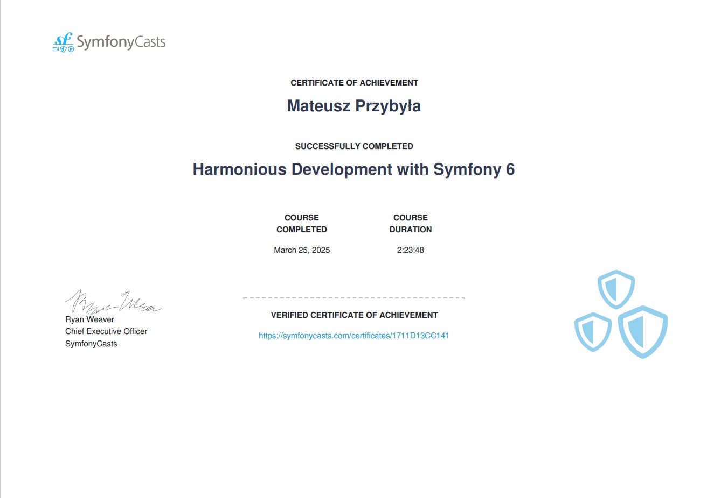
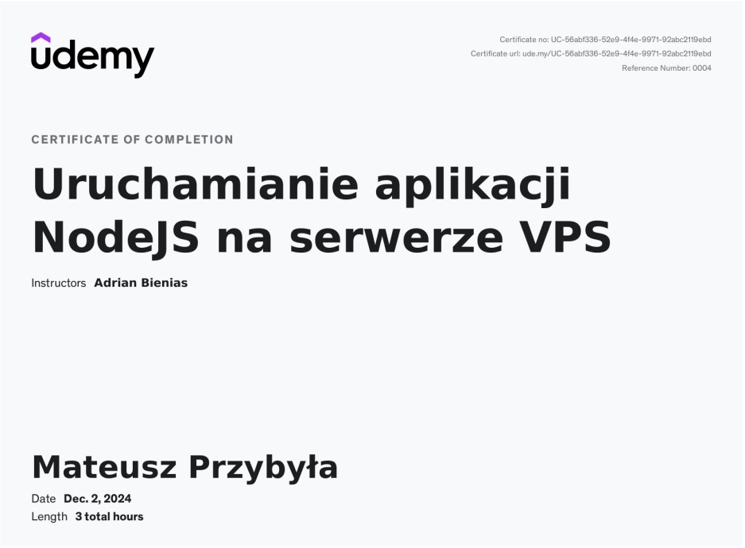
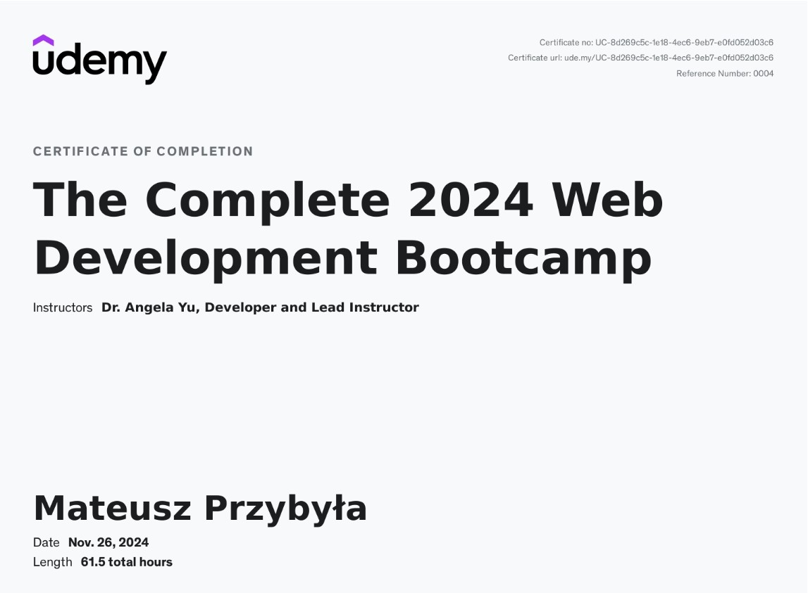
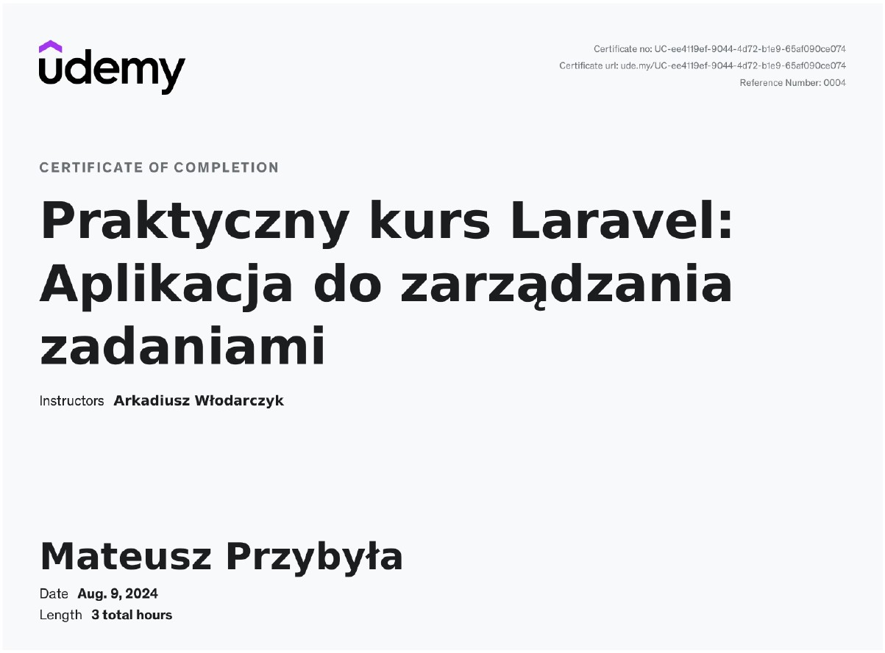
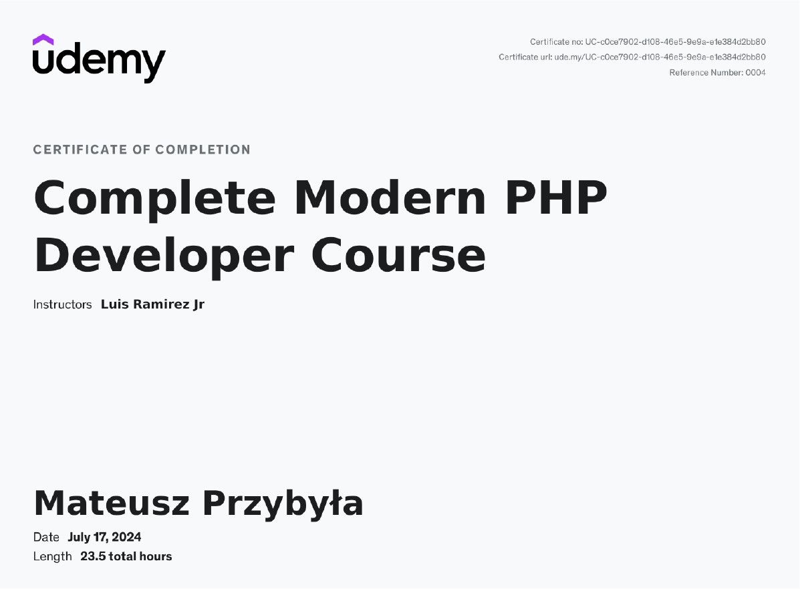
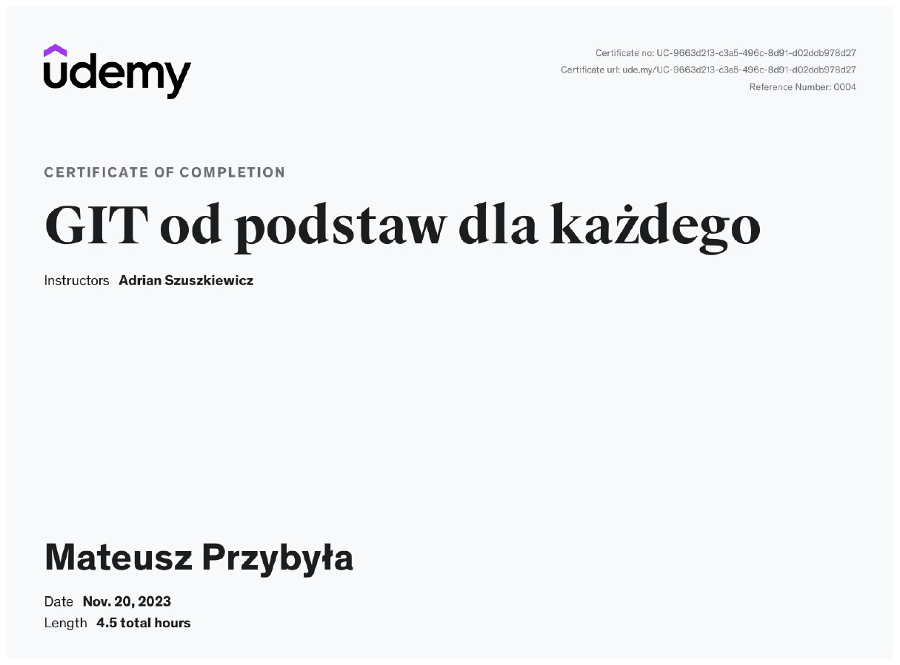
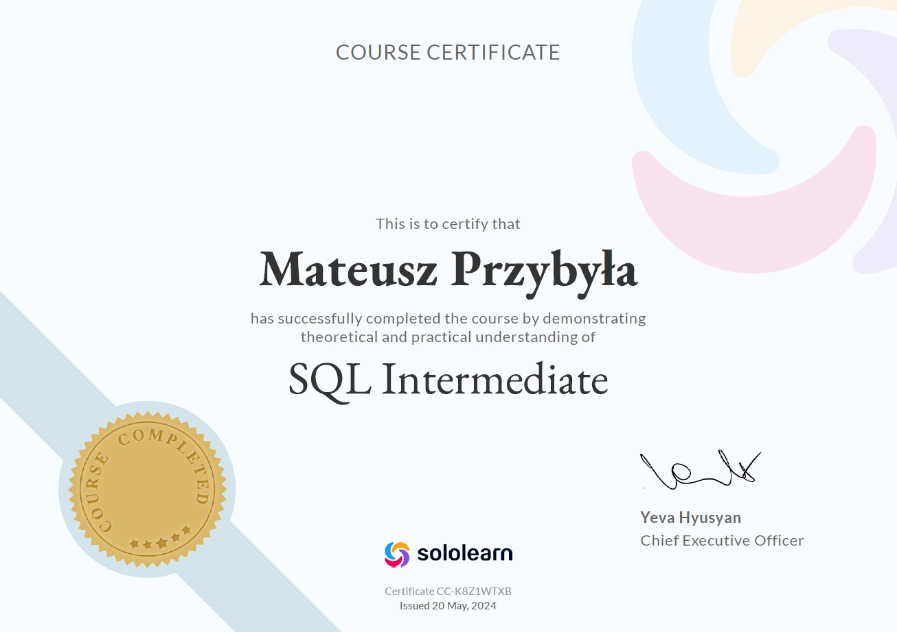
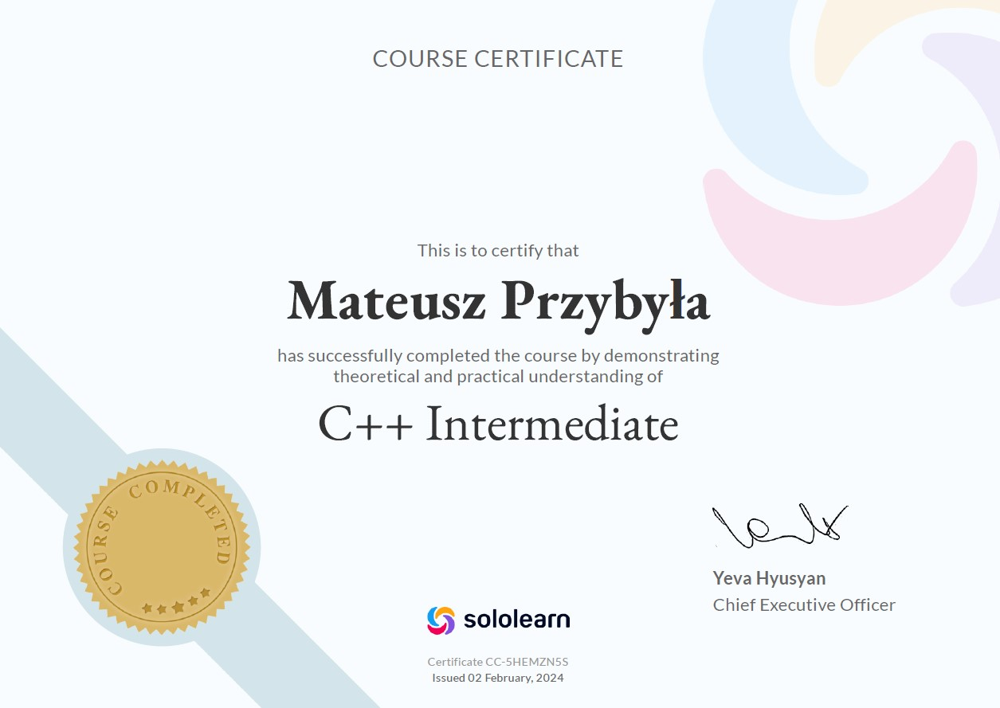
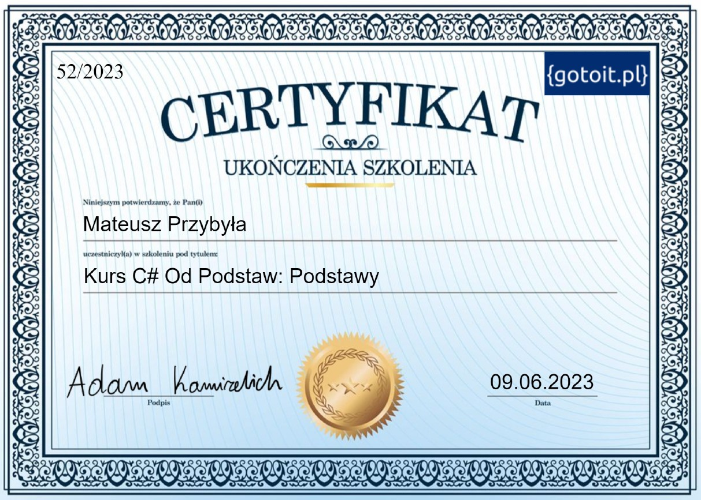

# My IT Certificates

I present my certificates of completed courses.

## Table of contents

- [SymfonyCasts](#symfonycasts)
  - [Harmonious Development with Symfony 6](#harmonious-development-with-symfony-6)
- [UDEMY](#udemy)
  - [Uruchamianie aplikacji NodeJS na serwerze VPS](#uruchamianie-aplikacji-nodejs-na-serwerze-vps)
  - [The Complete 2024 Web Development Bootcamp](#the-complete-2024-web-development-bootcamp)
  - [Praktyczny kurs Laravel](#praktyczny-kurs-laravel)
  - [Complete Modern PHP Developer Course](#complete-modern-php-developer-course)
  - [GIT od podstaw dla każdego](#git-od-podstaw-dla-każdego)
- [Sololearn](#sololearn)
  - [Intermediate SQL](#intermediate-sql)
  - [Introduction to SQL](#introduction-to-sql)
  - [Intermediate JavaScript](#intermediate-javascript)
  - [Introduction to JavaScript](#introduction-to-javascript)
  - [Introduction to CSS](#introduction-to-css)
  - [Introduction to HTML](#introduction-to-html)
  - [Cpp Intermediate](#cpp-intermediate)
  - [Tech for Everyone](#tech-for-everyone)
  - [Introduction to Cpp](#introduction-to-cpp)
- [gotoit](#gotoit)
  - [Kurs Csharp: Podstawy](#kurs-csharp-podstawy)

## SymfonyCasts

### Harmonious Development with Symfony 6

## UDEMY

### Uruchamianie aplikacji NodeJS na serwerze VPS

### The Complete 2024 Web Development Bootcamp

### Praktyczny kurs Laravel

### Complete Modern PHP Developer Course

### GIT od podstaw dla każdego

## Sololearn

### Intermediate SQL

### Introduction to SQL

### Intermediate JavaScript

### Introduction to JavaScript

### Introduction to CSS

### Introduction to HTML

### Cpp Intermediate

### Tech for Everyone

### Introduction to Cpp

## gotoit

### Kurs Csharp: Podstawy

